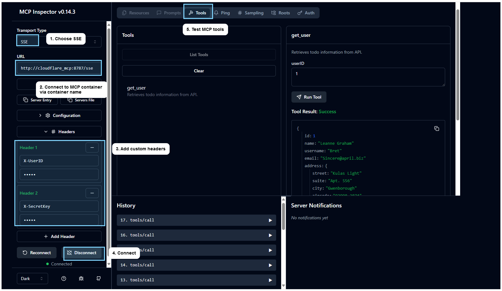
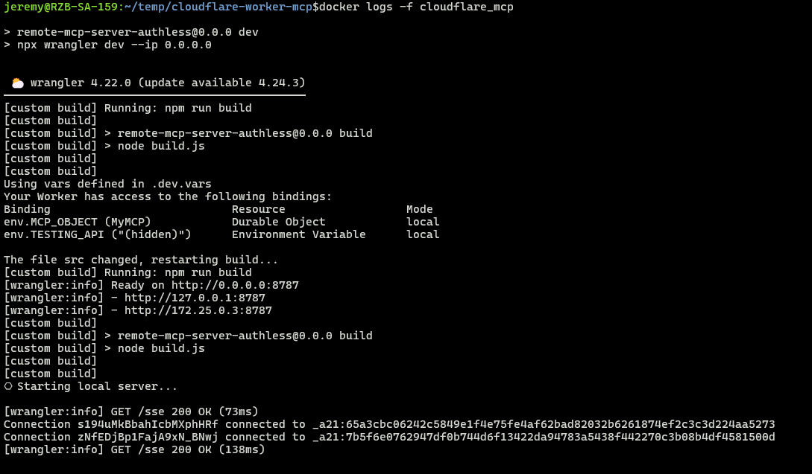
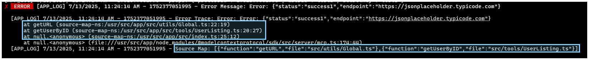

# Cloudflare Worker MCP
- This implements a Model Context Protocol (MCP) server, built upon the **Cloudflare Worker**.

# Setup Guide
* **Setup env.**
  * Copy `.dev.vars.example` to `.dev.vars`.
  * Copy `.env.example` to `.env`.
* **Install node packages** via `npm install`.
* **Start up** docker via `docker compose up -d`.
* Open **MCP Inspector** via [http://localhost:6274](http://localhost:6274)
* **Test MCP Tool**
  * Connect to [http://localhost:8787/sse](http://localhost:8787/sse)
  * Test any tool



* Check logs via `docker logs -f cloudflare_mcp`



# File Source Mapping
- To get actual file name for error handling.
- Create **build.js** via ESBuild plugin.
- Install `"esbuild": "^0.25.6"` via package.json.
- Add `"build": "node build.js"` to package.json.
- Add below to wrangler.jsonc.
    > ```json
    > "build": {
    >     "command": "npm run build"
    > }
    > ```
- Add below to script file.
    > ```javascript
    >     // placeholder for file name
    >     const SOURCE_FILE_MAP = null;
    >       
    >     // get filename & function name
    >     } catch (error) {
    >         (error as any).sourceFileMaps = [...((error as any).sourceFileMaps ?? []), { function: getCurrentFunctionName(), file: SOURCE_FILE_MAP }];
    >         throw error;
    >     }
    > ```
- Everytime **wrangler deploy** and **wrangler dev** will build the **/dist** scripts.
- Whenever catch error, it will able to actual filename

